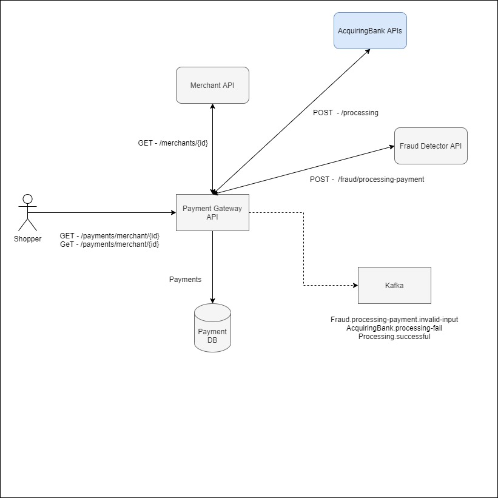

# Payment Gateway API

Payment Gateway APi is responsible to process Shopper's payment across multiple Acquiring Banks, being able to address a sucessful processment and handle errors and frauds.

#### Main actions :
* Paymentvalidation : Validate Business Rules
* Acquiring Bank Processing 

## Tech

### Stack
* .Net Core 5
* MongoDB
* Tests
    * XUnit
    * Autofixture
    * Moq

### Dependency

### How to Run

## Functional Level

### Top level Diagram

### 

## Payment Gateway Development decisions

###
