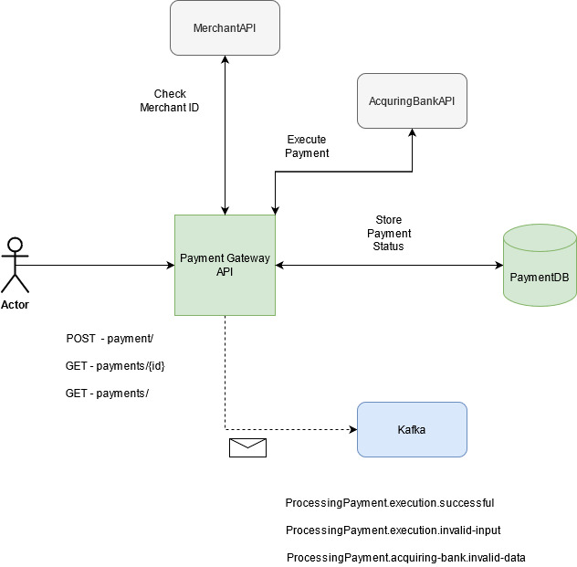

# Payment Gateway API

Payment Gateway APi is responsible to process Shopper's payment across multiple Acquiring Banks, being able to address a sucessful processment and handle errors and frauds.

#### Main actions :
* Paymentvalidation : Validate Business Rules
* Acquiring Bank Processing 

## Tech

### Stack
* .Net Core 5
* MongoDB
* Tests
    * XUnit
    * Autofixture
    * Moq
* Docker
* 

### Dependency

* Merchants API : validate and consume Merchant info
* Fraud API : Check on Fraud API if there is any data or car inconsistency 
* Acquiring Bank API : Executes the payment processing
* MongoDB : Stores processing data
* Kafka : Send messages to Frauds and Payment Processing Status topics

### How to Run

## Functional Level

### Top level Diagram

### 

#### Endpoings
For full endpoints descriptions please run the project and find /swagger
* [POST] Payments
* [GET] Payments/{id}
* [GET] Payments?CardLastFourDigits=&CurrentPage=0&ItemsPerPage=10

## Payment Gateway Development decisions

###
